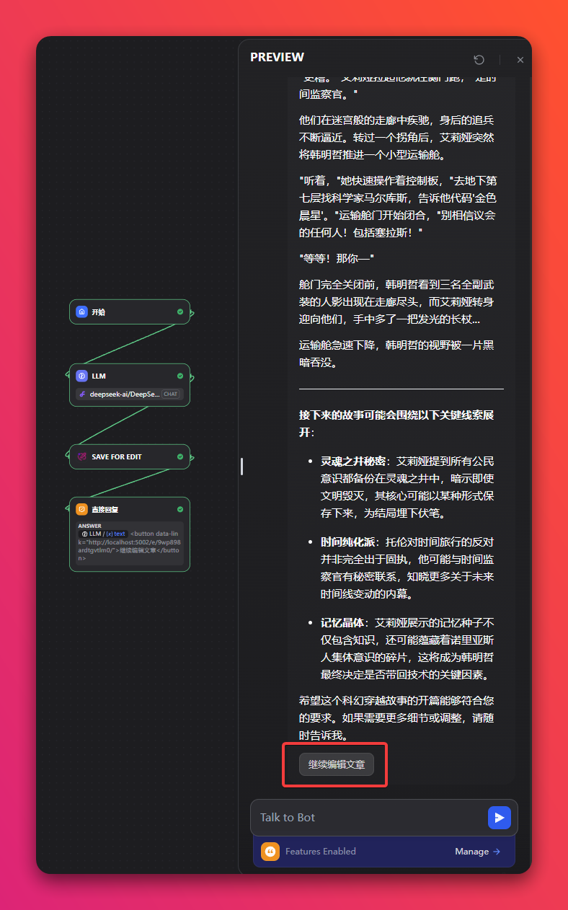
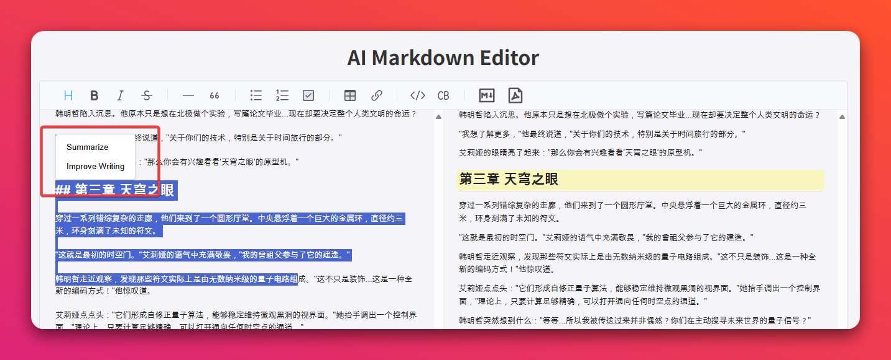
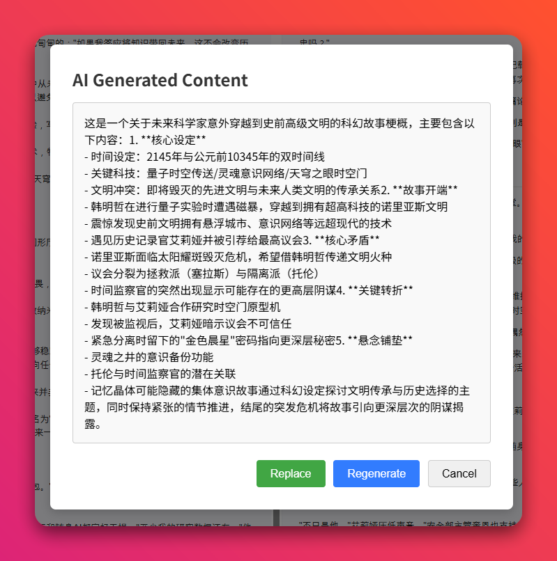

## Markdown Editor

**Author:** hjlarry  
**Version:** 0.0.1  
**Type:** extension  
**Repo&Issue:**  [https://github.com/hjlarry/dify-plugin-markdown_editor](https://github.com/hjlarry/dify-plugin-markdown_editor)

### Description

This tool help you edit the markdown content which the workflow generated.

Suppose you have a complicated workflow generate a long content.


But you only want to modify part of it, you can save the content and open the link of the endpoint to open the markdown editor.

Select the content which you want to edit,  let the LLM regenrate it for you.




the regenerate content and prompt can be config, for example:

```json
[
  {
    "operationTitle": "Summarize",
    "operationPrompt": "Summarize the content follow"
  },
  {
    "operationTitle": "Improve Writing",
    "operationPrompt": "Try to find a good way to express the following content"
  },
  {
    "operationTitle": "Translate To English",
    "operationPrompt": "Translate the following content into English"
  }
]
```
